# Spring Legacy + JSP + Apache Tiles + Maven

---

### 프로젝트 기본 구성

- Adoptium: jdk-8.0.312.7-hotspot
- Apache Tomcat Embedded: 7.0.109
- Apache Tomcat 8.5.73
- Spring Framework: 4.3.30.
- Tiles JSP Support: 3.0.8
- MariaDB Java Client: 2.7.4
- HikariCP: 4.0.3
- MyBatis: 3.5.7
- MyBatis Spring: 2.0.6
- Logback Project: 1.2.8
- Log4Jdbc Log4j2 JDBC 4 1: 1.16

---

## 1. 프로젝트 생성

### 1.1 Maven을 이용한 프로젝트 생성

- [Ctrl + Shift + P] > Maven: Create Maven Project > maven-archetype-webapp 로 기본 프로젝트 생성 후 java 폴더 및 spring 설정 파일 폴더를 추가로 생성합니다.

  <details><summary>보기</summary>

  - Maven: Create Maven Project 실행

  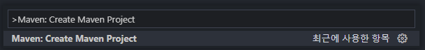

  - maven-archetype-webapp 실행

  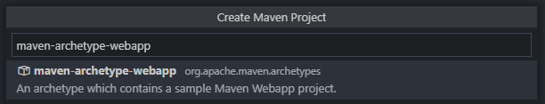

  - archetypeVersion 설정

  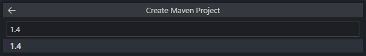

  - groupId 설정

  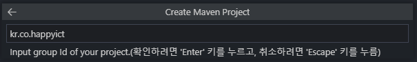

  - artifactId 설정

  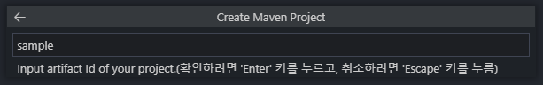

  - 프로젝트를 생성할 폴더를 설정

  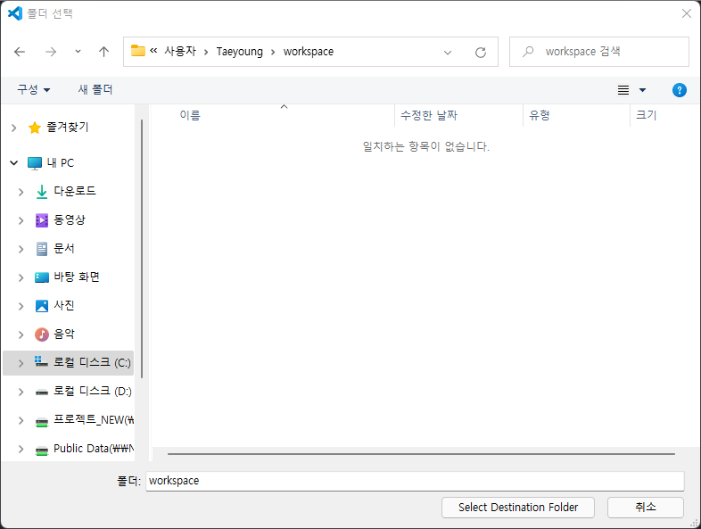

  - Open 클릭

  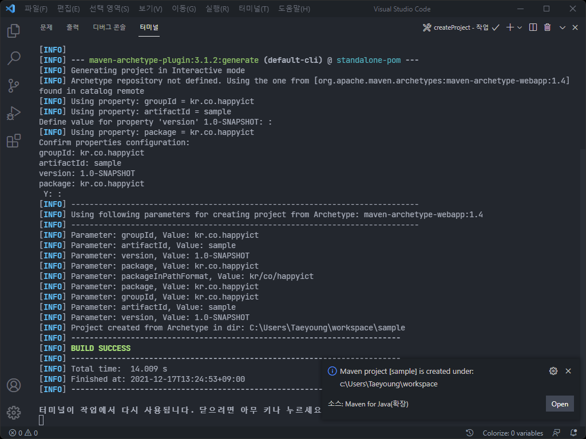

  - 생성된 프로젝트 구조

  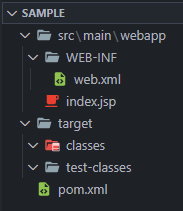

</details>

### 1.2 기존 템플레이트 재사용

- STS(Spring Tool Suite)에서 만든 프로젝트 혹은 기타 기존 템플레이트가 있다면 재사용이 가능합니다.
- [template > happyLegacy.zip] 사용합니다.

---

## 2. 프로젝트 실행

- 이 문서는 기존 템플레이트를 재사용하여 프로젝트를 실행합니다.
- 파일 > 폴더 열기 [Ctrl + K, O] > Ctrl을 누른 상태에서 순서대로 K, O를 입력합니다.

  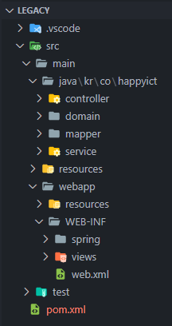

- mvnDebug, Tomcat for Java 확장팩을 사용한 실행방법이 있습니다.

### 2.1 mvnDebug (기존 STS와 유사한 방법)

#### 2.1.1 .vscode에 json파일 추가하기

- launch.json

  <details><summary>보기</summary>

  ```json
  {
    "version": "0.2.0",
    "configurations": [
      {
        "type": "java",
        "name": "Happy Debug",
        "request": "attach",
        "hostName": "localhost",
        "port": 8000,
        "preLaunchTask": "happyRun",
        "postDebugTask": "happyStop"
      }
    ]
  }
  ```

  </details>

- task.json

  <details><summary>보기</summary>

  ```json
  {
    "version": "2.0.0",
    "tasks": [
      {
        "label": "happyRun",
        "type": "shell",
        "command": "mvnDebug -f pom.xml tomcat7:run",
        "group": "build",
        "isBackground": true,
        "problemMatcher": [
          {
            "pattern": [
              {
                "regexp": "\\b\\B",
                "file": 1,
                "location": 2,
                "message": 3
              }
            ],
            "background": {
              "activeOnStart": true,
              "beginsPattern": "^.*Listening for",
              "endsPattern": "^.*transport dt_socket at address.*"
            }
          }
        ]
      },
      {
        "label": "happyStop",
        "type": "shell",
        "command": "echo ${input:terminate}}",
        "problemMatcher": []
      }
    ],
    "inputs": [
      {
        "id": "terminate",
        "type": "command",
        "command": "workbench.action.tasks.terminate",
        "args": "happyRun"
      }
    ]
  }
  ```

  </details>

#### 2.1.2 디버그 실행방법

- 죄측의 실행 및 디버그 버튼 클릭합니다. [Ctrl + Shift + D]

- 상단의 디버깅 시작 클릭합니다 [F5]

  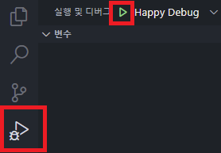

#### 2.1.2 클래스 및 JSP 수정 적용 및 디버깅 종료방법

- 클래스를 수정하고 Hot Code Replace를 클릭합니다. (빨간색)

  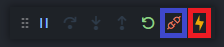

- JSP는 수정 후 바로 적용이 됩니다.

- 연결해제 아이콘을 클릭하면 디버깅 모드가 종료됩니다. [Shift + F5] (파란색)

### 2.2 Tomcat for Java

#### 2.2.1 Maven 빌드

- MAVEN 탭에서 clean > package 순으로 클릭합니다.

  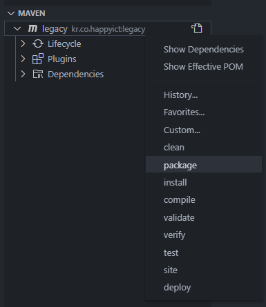

- 터미널에서 실행 시.

  ```
  mvn clean package
  ```

#### 2.2.2 외부 Tomcat에 war파일 구동

- TOMCAT SERVERS 탭에서 "+" 버튼을 클릭 후 Tomcat이 설치된 위치를 지정합니다.

  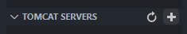

- target 폴더 아래에 생긴 war파일을 우클릭하여 Run on Tomcat Server 합니다.

  - Tomcat 구동시 Root Path로 구동하기 위해 pom.xml의 build 항목에서 finalName을 ROOT로 설정하여 ROOT.war로 파일 생성되게 하였습니다.

  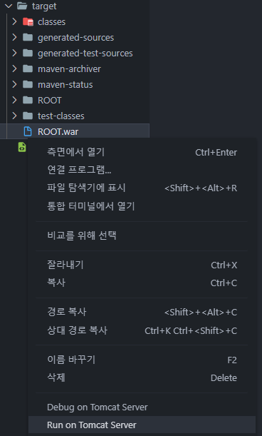

#### 2.2.3 war 재배포 방법

- 먼저 TOMCAT SERVERS 탭에서 Stop을 클릭하여 Tomcat을 종료 시킨 후 다시 Maven 에서 생성된 ROOT.war 파일을 우클릭하여 Run on Tomcat Server 합니다.

  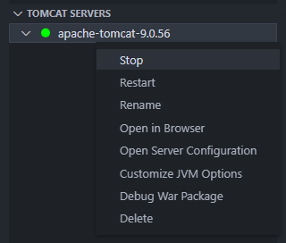

---

## 3 웹 브라우저로 결과 확인

- TOMCAT SERVERS 탭에서 Open in Browser 항목 클릭 혹은 직접 브라우저로 통해서 확인합니다.

  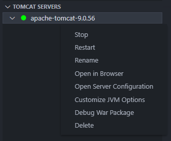

  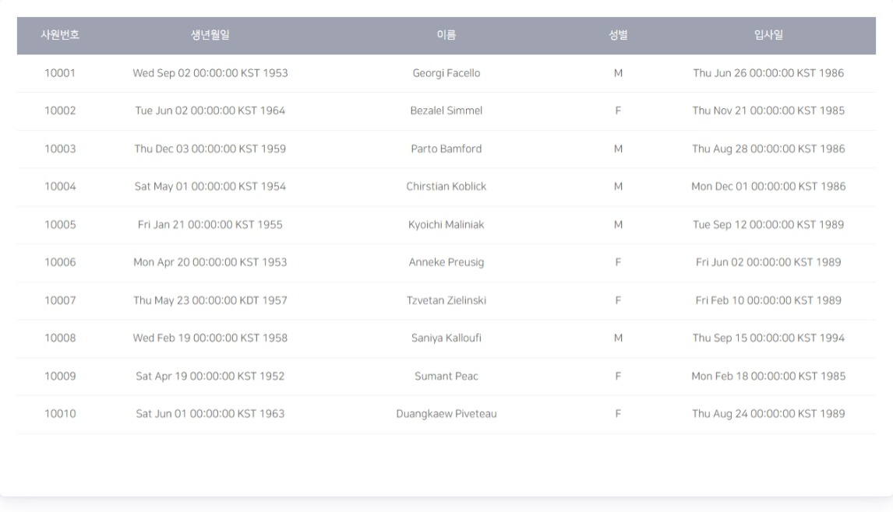

  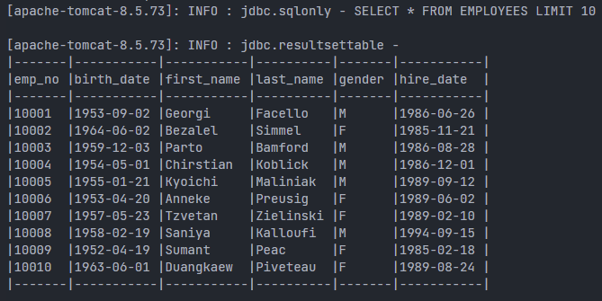
