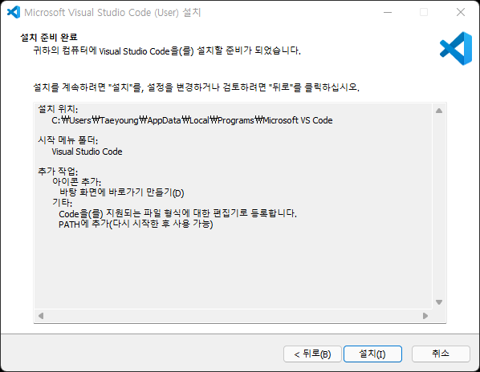

# Visual Studio Code 설치

---

## 1. Visual Studio Code 설치 및 확장팩 설치

### 1.1 Visual Studio Code 다운로드

- https://code.visualstudio.com 에 접속하여 설치파일을 다운로드 합니다.

- [VSCodeUserSetup-x64-1.63.0.exe](https://az764295.vo.msecnd.net/stable/7db1a2b88f7557e0a43fec75b6ba7e50b3e9f77e/VSCodeUserSetup-x64-1.63.0.exe) [작성일 기준 최신버전]

  

### 1.2 Visual Studio Code 설치

설치 과정
 

### 1.3. 확장팩 설치

- 화면 좌측 확장 아이콘 클릭 혹은 단축키 [Ctrl + Shift + X] 입력 후 원하는 확장팩을 검색 한 뒤 설치 버튼을 클릭합니다.

  

---

## 2. 개발환경 별 확장팩 정리

### 2.1 공통

- [Extension Pack for Java](vscode:extension/vscjava.vscode-java-pack)

  - Java 확장팩 모음. 이하 6개 항목들이 설치됩니다.

  - [Language Support for Java™ by Red Hat](vscode:extension/redhat.java)

    - Supports code from Java 1.5 to Java 17
    - Latest Java 11 is the current minimum requirement

  - [Debugger for Java](vscode:extension/vscjava.vscode-java-debug)
  - [Test Runner for Java](vscode:extension/vscjava.vscode-java-test)
  - [Maven for Java](vscode:extension/vscjava.vscode-maven)
  - [Project Manager for Java](vscode:extension/vscjava.vscode-java-dependency)
  - [Visual Studio IntelliCode](vscode:extension/VisualStudioExptTeam.vscodeintellicode)

- [Lombok Annotations Support for VS Code](vscode:extension/GabrielBB.vscode-lombok)
- [XML](vscode:extension/redhat.vscode-xml)
- [ESLint](vscode:extension/dbaeumer.vscode-eslint)
- [JavaScript (ES6) code snippets](vscode:extension/xabikos.JavaScriptSnippets)

#### 2.1.1 Eclipse Keymap

- [Eclipse Keymap](vscode:extension/alphabotsec.vscode-eclipse-keybindings)

#### 2.1.2 편의성

- [Prettier - Code formatter](vscode:extension/esbenp.prettier-vscode)
- [Auto Rename Tag](vscode:extension/formulahendry.auto-rename-tag)
- [Bracket Pair Colorizer 2](vscode:extension/CoenraadS.bracket-pair-colorizer-2)
- [indent-rainbow](vscode:extension/oderwat.indent-rainbow)
- [CSS Peak](vscode:extension/pranaygp.vscode-css-peek)
  - HTML에서 동작하나, JSP에선 동작이 불가합니다.
- [colorize](vscode:extension/kamikillerto.vscode-colorize)

- [Code Spell Checker](vscode:extension/streetsidesoftware.code-spell-checker)
- [Better Comments](vscode:extension/aaron-bond.better-comments)

### 2.2 Spring Legacy Project

- [Java Server Pages (JSP)](vscode:extension/pthorsson.vscode-jsp)
- [Tomcat for Java](vscode:extension/adashen.vscode-tomcat)

### 2.3 Spring Boot Project

- [Spring Boot Extension Pack](vscode:extension/Pivotal.vscode-boot-dev-pack)

### 2.4 REST

- [REST Client](vscode:extension/humao.rest-client)
- [Thunder Client](vscode:extension/rangav.vscode-thunder-client)

### 2.5 테마

- [One Dark Pro](vscode:extension/zhuangtongfa.Material-theme)
- [Material Icon Theme](vscode:extension/PKief.material-icon-theme)
